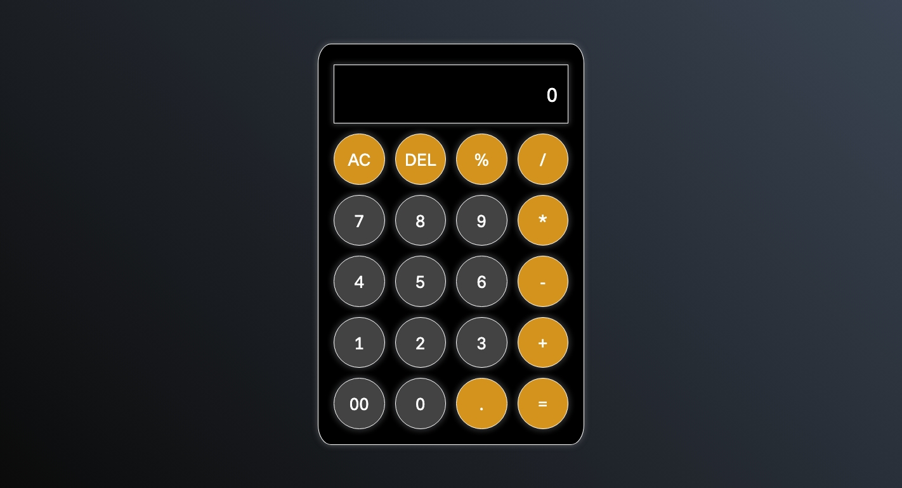

# 🧮 Basic Calculator

A simple, clean, and stylish calculator built using **HTML**, **CSS**, and **JavaScript**. This project helps reinforce foundational front-end skills, especially working with layout techniques and responsive design.

## 🚀 Features

- Perform basic arithmetic operations: `+`, `-`, `*`, `/`, `%`
- Clear (`AC`), delete (`DEL`), and evaluate (`=`)
- Button-based input (no keyboard handling)
- Responsive layout with adaptive button grid
- Aesthetic dark theme with glowing button shadows

## 📸 Preview

> 

## 🧱 Technologies Used

- **HTML5**
- **CSS3**
  - **CSS Grid** for arranging the buttons
  - **Flexbox** for centering the calculator on the page
- **Vanilla JavaScript** for functionality (to be implemented)

## 📱 Responsiveness

- The layout adjusts smoothly to various screen sizes (desktop, tablet, mobile)
- Designed with relative units (`rem`, `%`, `vh`, `vw`)
- Some further optimization (like vertical responsiveness and `clamp()` usage) can be added later

## 📂 Project Structure

```
project-1-basic-calculator/
├── index.html
├── style.css
└── script.js
```

## ✏️ Customization

- Modify the color scheme in `style.css`
- Add additional functionalities like keyboard input
- Enhance user interaction with animations or sounds

## ✅ Getting Started

1. Clone the repository or download the files
2. Open `index.html` in your browser
3. Use the calculator and enjoy!
